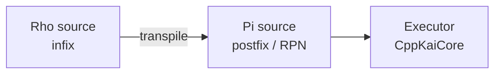
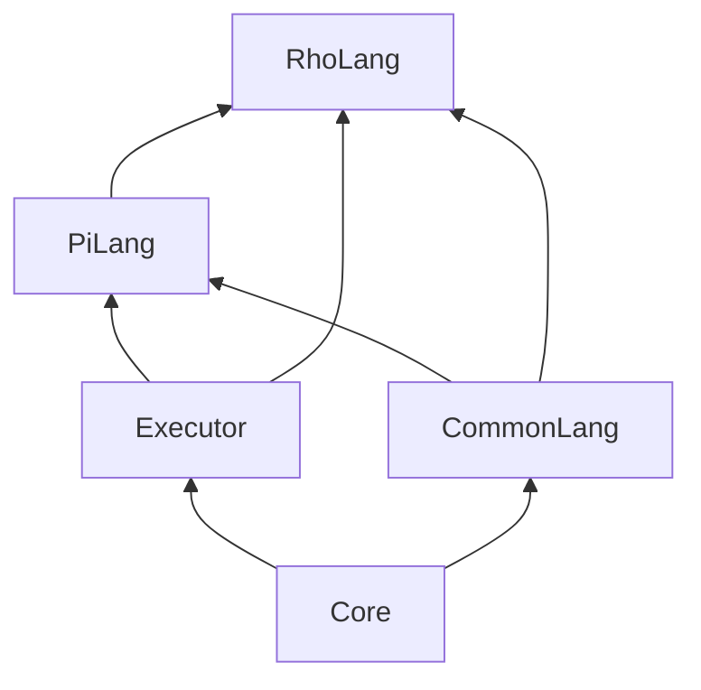
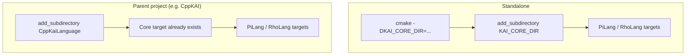

# CppKaiLanguage Architecture

## Language pipeline

Rho source transpiles to Pi; Pi is what the Executor (in CppKaiCore)
actually evaluates. Rho exists because most people, including Christian,
find infix syntax easier to write — Pi alone is genuinely usable directly
too, RPN-style, for anyone comfortable with a stack.

## Module dependency graph

`PiLang` and `RhoLang` are the two CMake targets this repo defines. Rho
depends on Pi (it lowers to it); both depend on CppKaiCore's `Core`,
`Executor`, and `CommonLang` targets, either as an existing target in a
parent build or via `add_subdirectory(KAI_CORE_DIR)` in a standalone build.

## Build modes

